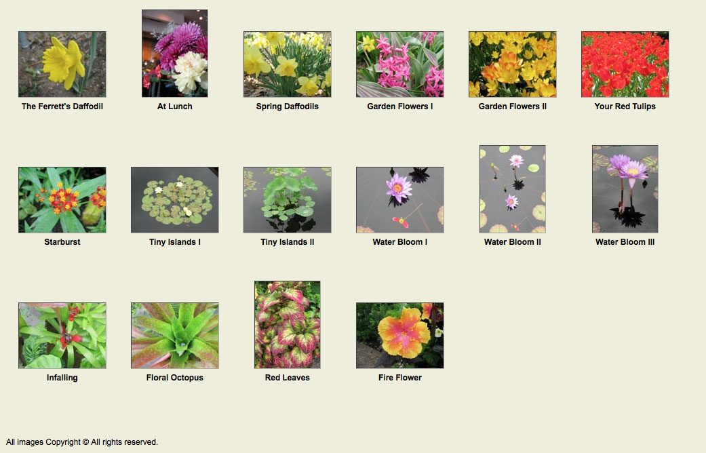

# Front End Foundations Session Three

## Homework

1. Following the steps we took in the Contact Sheet exercise, add a third css style sheet to make the layout look like this.

and add it to the style sheet switcher (see the `_contact-sheet-done` folder).


## Reading 

* [Responsive Web Design](https://abookapart.com/products/responsive-web-design) - finish it
* [JavaScript for Web Designers](https://abookapart.com/products/javascript-for-web-designers) Chapter 1 -Getting Set Up, Chapter 2 - Understanding Data Types, Chapter 3 - Conditional Statements


## Server Accounts

[See session one](https://github.com/front-end-foundations/session1#aside---server-accounts)


## Sushi Review

* the anchor tags use display flex

```
.nav {
	display: flex;
	padding: 0;
}
.nav li { 
	flex: 1;
	background-color: #d00;
	list-style: none;
	text-align: center;
}
```


### DOM Scripting

* Selecting items with `document.querySelector`

* attaching events with `addEventListener()`

* Manipulating HTML with `classList`

```
<script>
	var mapClicker = document.querySelector('.map')
	var popOver = document.querySelector('.popover')
	mapClicker.addEventListener('click', show)

	function show(){
		popOver.classList.toggle('showme')
		event.preventDefault()
	};
</script>
```

We designed the popover and hid it:

```
.popover {
	padding: 1rem;
	width: 300px;
	height: 225px;
	background: #fff;
	border: 1px solid var(--hilite-color);
	border-radius: var(--radius);
	position: fixed;
	top: calc(50% - 100px);
	left: calc(50% - 150px);
	display: none;
}
```

And created the class that will be added by classList.add():

```
.showme {
	display: block;
}
```

### Homework: Adding a [X] to close the popover.

1. make the css external
2. some usage samples from [Font Awesome](http://fontawesome.io/examples/)
3. make font awesome accessible: `@import url(font-awesome-4.6.3/css/font-awesome.min.css);`
4. http://fontawesome.io/icons/ looks like `fa-times` will work

```
<div class="popover">
	<span class="closer"><i class="fa fa-times" aria-hidden="true"></i></span>
	<iframe>...</iframe>
</div>
```

```
.popover .closer {
	float:right;
}
```

```
<script type="text/javascript">
	var mapClicker = document.querySelector('.map')
	var popOver = document.querySelector('.popover')
	var closeButton = document.querySelector('.closer')
	mapClicker.addEventListener('click', show)
	closeButton.addEventListener('click', show)

	function show(){
		popOver.classList.toggle('showme')
		event.preventDefault()
	}
</script>
```

Try a recipe from font-awesome:

```
<span class="closer fa-stack fa-md">
	<i class="fa fa-square fa-stack-2x"></i>
	<i class="fa fa-times fa-stack-1x fa-inverse" aria-hidden="true"></i>
</span>
```

```
.popover .closer {
  /* float: right; */
	position: absolute;
	top: -11px;
	right: -14px;
	color: var(--rust);
}
```

Don't forget to add a shadow to the popover.

```
box-shadow: 4px 4px 6px rgba(0,0,0,0.3)
```

..and becasue we are not using an anchor tag:

```
cursor: pointer;
```

...or better yet:

```
<span class="closer fa-stack fa-md">
	<a href="https://www.google.com/maps/place/Geido/@40.6778979,-73.9749227,17z/data=!3m1!4b1!4m5!3m4!1s0x89c25ba8edab126b:0xfaa0551477e2ec72!8m2!3d40.6778939!4d-73.972734" target="_blank">
	<i class="fa fa-square fa-stack-2x"></i>
	<i class="fa fa-times fa-stack-1x fa-inverse" aria-hidden="true"></i>
	</a>
</span>
```

...and a overlay for effect:

```
<body>
<div class="overlay"></div>
<div id="wrapper">
```

```
.overlay {
    display: block;
    position: fixed;
    top: 0;
    left: 0;
    width: 100vw;
    height: 100vh;
    z-index: 10;
    background-color: rgba(0, 0, 0, 0.5);
}
```

...and turn it on:

```
var mapClicker = document.querySelector('.map')
var popOver = document.querySelector('.popover')
var closeButton = document.querySelector('.closer')
var overlay = document.querySelector('.overlay')
mapClicker.addEventListener('click', show)
closeButton.addEventListener('click', show)

function show(){
	popOver.classList.toggle('showme')
	overlay.classList.toggle('showme')
	event.preventDefault()
}
```

Important to note here that there is no possibility of animating this because we are using `display: block` and `display: none`. These are binary states and cannot be used for effects like fading on etc. More on this in a later class.

But we can animate the button:

```
a {
	color: #aa0000;
	text-decoration: none;
	transition: color .5s;
}
a:hover {
	text-decoration: underline;
	color: red;
}
```


Notes


