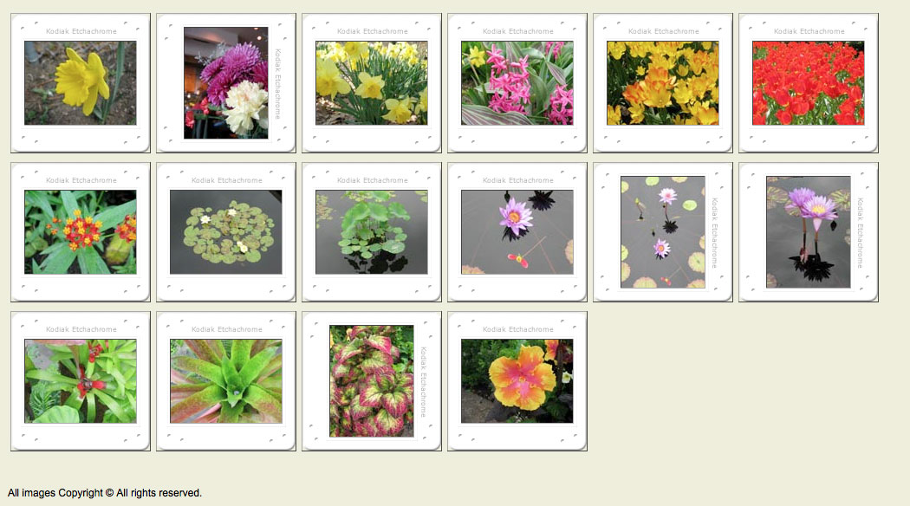

#FOUNDATIONS Session Three


##Floating Image Gallery

Goals:

* keep as many images as possible above the fold
* no horizontal scroll bars 

###Lay of the land

The following classes are used in the html:

* pic - any div with a picture
* ls - landscape (image size 128 x 96)
* pt - portrait (image size 96 x 128)
* tn - thumbnail link
* title / catno / price (list item classes)


###Part One - Contact Sheet



Create and new stles.css document in the styles directory and link it to start.html.

Add Google font:

```css
@import url('http://fonts.googleapis.com/css?family=Lato:300,400,700');
```

Add and examine the normalize.css file

```html
<link rel="stylesheet" href="styles/normalize.css" />
```

Add the base styles:

```css
body {
	background:#eed;
	padding:1em;
	font-family: 'Lato', sans-serif;
	font-size: 62.5%; 
}
#footer {
	padding-top: 3em;
	font-size: 1em; 
}
```

Examine the footer font size, height and padding in the inspector. Look at computed (as opposed to rules) in the inspector. 

The font size is 62.5% of 1em or 10px, the height is 12px and padding is 62.5% of 3em or 30px.

Lesson: The box model uses font size to calculate padding. It creates a context where measurements are relative.


Change the base font size to 100%. 

```css
body {
	...
	font-size: 100%; 
}
```

Add:

```css
.pic ul {
  display: none;
}
```

```css
.pic {
  float: left; 
  height: 128px; 
  width: 128px;
  border: 1px solid black;
}
```
Edit 
```
#footer { 
	...
	clear:both;
}
```

Note the clear property and the effect it has on the collapsed body. No floating elements are allowed on the left or the right side of a cleared both item. 

```css
.pic {
  ...
  margin: 5px 3px; 
}
```

We want all images to be centered vertically and horizontally within a square and so want the height and width to be the same. We do this by adding 16px to the top and bottom of .ls and to the left and right of .pt. (16 x 2 =36) (96 + 36 = 128)

```css
.ls img { 
  height:96px; 
  width:128px;
  margin: 16px 0;
}
.pt img {
  height:128px;
  width:96px;
  margin:0 16px;
}
```

Examine the frame-ls and -pt images - they are 160px square


background-image vs ``?

Edit the pic class to add 1em (16px) padding and the background images. The additional padding takes the overall size to 160px:

```css
.pic {
  ...
  padding: 1em; 
  background: url(img/frame-ls.gif) center no-repeat;
}
```

Override the portrait style frames to use a different image.

```css
.pt {
	background-image: url(img/frame-pt.gif);
}
```
Add a dimensional border to the images.

```css
.pic img {
  border: 1px solid #444; 
  border-color: #444 #aaa #aaa #444;
 }
 ```

Remove the border from the pic divs.


###Part Two - Catalog View


Leave the following in from the first sample:
```css
@import url('http://fonts.googleapis.com/css?family=Lato:300,400,700');

body {
    background:#eed;
    padding:1em;
    font-family: 'Lato', sans-serif;
}
#footer {
    padding-top: 3em;
    font-size: 1.25em;
}
```
Then continue by adding:

```css
.pic .tn {
	float: left;
 }

.pic {
	margin: 10px;
	clear: left;
	width: 350px;
}
```

Portrait - align the image thumbnails:

```css
.pt .tn {
	width: 96px;
	margin-right: 32px;
}
```

Landscape - align the image thumbnails

```css
.ls .tn {
	width: 128px 
}

.tn img {
	border: 1px solid #333;
}
```

Add margins and padding to separate text and pic and remove bullets

```css
.pic ul {
	padding: 0;
	margin-left:140px;
	list-style: none;
	border: 3px double #552;
}
```
Format content:

```css
.pic .title {
	font-weight: bold;
	font-size: 1rem;
    padding: 0.5rem 0;
	border-bottom: 1px solid #333;
	padding-left: 0.5rem;
}
.pic .catno {
	color: #777; 
	text-align: right;  
}
.pic .price {
	color: #777; 
	text-align: right;
}
```

Slide items against each other.

Establish a base height for the list items

```css
.pic li {
	line-height: 1.2rem; 
}
```

EDIT - Move catno over

```css
.pic.catno {
  ...
	margin-right: 4.5rem;  
}
```

EDIT - Slide price up

```css
.pic .price {
  ... 
	margin: -1.2rem 0 0 0;
}
```


Boxing the information - vertical borders left of catno and between catno and price - auto allows movement to right as needed

EDIT 

```css
.pic .price {
  ...
	margin: -1.2rem 0 0 auto;
	width: 4rem;
	border-left: 1px solid #333;
}

.pic .catno {
  ...
	margin: 0 4.5em 0 auto;
	width: 4rem;
	border-left: 1px solid #333;
}
```

EDIT  move the price over a bit to avoid double border

```css
.pic .price {
  ...
	margin: -1.2rem 3px 0 auto;
}
```

Increase spacing between items
```css
.tn img {
  ...
	margin-bottom: 1rem;
}
```


##Homework

1. 


##Reading 
* CSS Mastery: Advanced Web Standards Solutions - chapters 4-5

Notes


