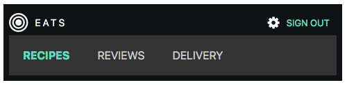

## FlexBox
* CSS Flexible Box Layout Module
* A simple guide to the various CSS properties on [CSS Tricks](https://css-tricks.com/snippets/css/a-guide-to-flexbox/)
* Try https://www.w3schools.com/css/css3_flexbox.asp

### A simple Flex Nav



[Font Awesome](http://fontawesome.io/)

Create the HTML:

```html
<!doctype html>
<html>
<head>
  <meta charset="UTF-8">
  <title>Display: flex nav</title>
</head>

<body>

  <header class="site-header">

    <a href="#0" class="logo">Logo</a>

    <nav class="site-nav">
      <ul>
        <li class="active"><a href="recipes.html">Recipes</a></li>
        <li><a href="reviews.html">Reviews</a></li>
        <li><a href="delivery.html">Delivery</a></li>
      </ul>
    </nav>

    <div class="account-actions">
      <div class="account-dropdown">
         Gear
        <ul>
          <li>Your Account</li>
        </ul>
      </div>
      <a href="#0" class="sign-out-link">Sign Out</a>
    </div>

  </header>

</body>
</html>

```

```
<link rel="stylesheet" href="font-awesome-4.6.3/css/font-awesome.min.css">
```

Logo:

```
<i class="fa fa-bullseye fa-3x"></i>
```

Gear:

```
<i class="fa fa-gear"></i>
```

A font stack that ensures the [device's default font](https://www.smashingmagazine.com/2015/11/using-system-ui-fonts-practical-guide/) will be used (native font):

```
body {
  font-family: -apple-system, BlinkMacSystemFont, "Segoe UI", Roboto, Helvetica, Arial, sans-serif;
}
```

```css
header {
  background: #0D1313;
  color: #fff;
  display: flex;
  align-items: center;
  padding:0.5rem;
}

.account-dropdown ul {
    display: none;
}

.logo {
  text-decoration: none;
  color: white;
  padding: 10px;
}

.site-nav ul {
  list-style: none;
  display: flex;
  margin: 0;
  padding: 0;
}

.site-nav  a {
  text-transform: uppercase;
  text-decoration: none;
  color: #CDD0D0;
  padding: 20px;
  display: inline-block;
}

.site-nav .active a {
  font-weight: bold;
  color: #62DEBE;
  background: #444;
}

.account-actions {
  margin-left: auto;
  display: flex;
  align-items: center;
  margin-right: 10px;
}

.sign-out-link {
  color: #62DEBE;
  font-size: 0.8rem;
  margin-left: 10px;
  text-transform: uppercase;
  text-decoration: none;
}
```

[The responsive meta tag](https://css-tricks.com/snippets/html/responsive-meta-tag/)

```css

@media (max-width: 600px) {
  header {
    flex-wrap: wrap;
  }
  .site-nav {
    order: 2;
    background: #333;
    width: 100%;
  }
}
```

Refactor CSS for `text-decoration`, `text-transform` ...

### Interactivity

See `index-done.html` for a demo.

Part ONE - get the gear icon to expose the options

```js

var gear = document.querySelector('.fa-gear')
var options = document.querySelector('.account-dropdown ul')

gear.addEventListener('click', showOptions)

function showOptions(){
  options.classList.toggle('active')
}
```

Note - requires corresponding CSS (see `index-done.html`)

```css

.active {
  display: flex !important;
}

.account-dropdown {
  position: relative;
  display: flex;
}

.account-dropdown ul {
  padding: 4px;
  margin: 0;
  list-style: none;
  position: absolute;
  top: 20px; 
  left: 10px;
  color: #333;
  background: #fff;
  font-size: 0.875rem;
}
```

Part TWO - add active class to the navigation
Introduces for loops and 'this' 

```js

var mainNav = document.querySelectorAll('.site-nav li')

for ( var i = 0; i < mainNav.length; i++){
  mainNav[i].addEventListener('click', setActive)
}

function setActive(){
  for ( var i = 0; i < mainNav.length; i++){
    mainNav[i].classList.remove('active')
  }
  this.classList.add('active')
  event.preventDefault()
}
```


