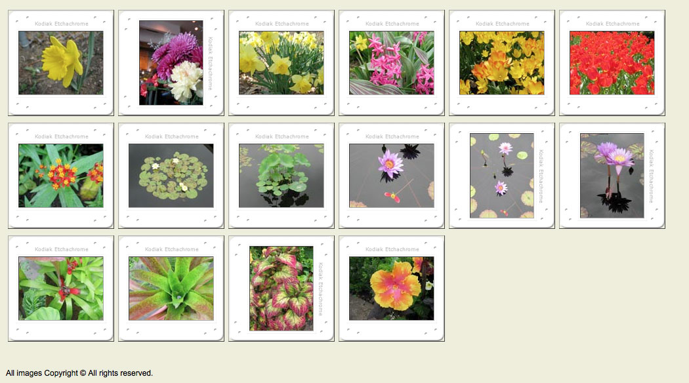
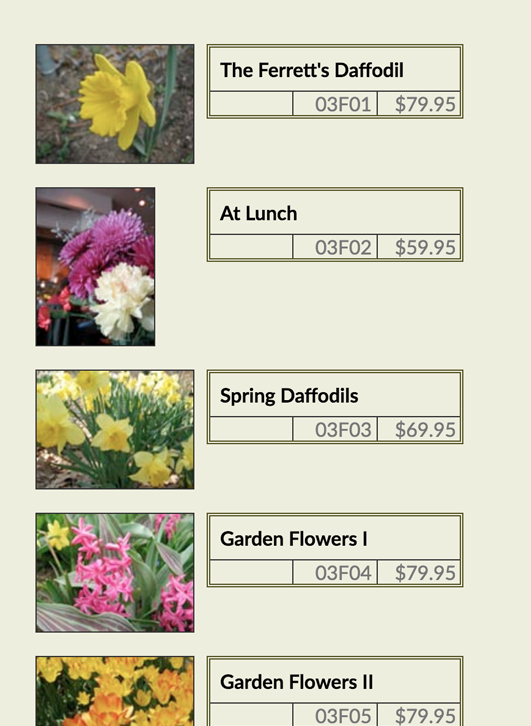

# Contact Sheet

### Lay of the land

The following classes are used in the html:

* pic - any div with a picture
* ls - landscape (image size 128 x 96)
* pt - portrait (image size 96 x 128)
* tn - thumbnail link
* title / catno / price (list item classes)

Note the use of multiple classes:

```
<div class="pic ls">
```

The images are 128px by 96px (landscape) or 96px by 128px (portrait)

Slide background images are 160px by 160px and are located in the css folder. 
(`background-image` vs ``)

🔥frame-ls and -pt images - are 160px square:


The black area in the center of each slide image is the same as the image sizes (128px by 96px or 96px by 128px).



Add and examine the normalize.css file

```html
<link rel="stylesheet" href="css/normalize.css" />
```

Create and new styles.css document in the css directory and link it to start.html.

```html
<link rel="stylesheet" href="css/styles.css" />
```

Add the base styles:

```css
body {
	background:#eed;
	padding:1em;
	font-family: verdana, sans-serif;
	font-size: 62.5%;
}
#footer {
	padding-top: 3em;
	font-size: 1em; 
}
```

Examine the footer font size, height and padding in the inspector. Look at computed (as opposed to rules) in the inspector. 

The font size is 62.5% of 1em or 10px, the height is 12px and padding is 62.5% of 3em or 30px.

Note: The box model uses font size to calculate padding. It creates a context where measurements are relative.

Change units to rem:

```
#footer {
  padding-top: 3rem;
  font-size: 1rem; 
}
```

rem = root em and is based on the top level HTML tag settings.

#### but I digress

Change the body font size to 100%. 

```css
body {
	...
	font-size: 100%; 
}
```

Add:

```css
.pic ul {
  display: none;
}
```

```css
.pic {
  float: left; 
  height: 128px; 
  width: 128px;
  border: 1px solid black;
}
```
Edit 
```
#footer { 
	...
	clear:both;
}
```

Note the clear property and the effect it has on the collapsed body. No floating elements are allowed on the left or the right side of a cleared both item. 

```css
.pic {
  ...
  margin: 20px 10px; 
}
```

We want all images to be centered vertically and horizontally within a160 x 160px square (ref the slide images). 

We do this by adding 16px to the top and bottom of .ls images and to the left and right of .pt images. (16 x 2 =36) (96 + 36 = 128)

```css
.ls img { 
  margin: 16px 0;
}
.pt img {
  margin:0 16px;
}
```

Edit the pic class to add 1em (16px) padding and the background images. 

The additional padding takes the overall size to 160px:

```css
.pic {
  ...
  padding: 1em; 
  background: url(img/frame-ls.gif) center no-repeat;
}
```

Override the portrait style frames to use a different image.

```css
.pt {
	background-image: url(img/frame-pt.gif);
}
```
Add a dimensional border to the images.

```css
.pic img {
  border: 1px solid #444; 
  border-color: #444 #aaa #aaa #444;
 }
```

Remove the border from the pic divs.


### Using Flexbox

Remove the float from `.pic` (and `clear: both` is no longer necessary).

Add a div with class wrap around all the pic divs.

#### Flex container

```
.wrap {
    display: flex;
}
```

Flex wrap:

` flex-wrap: nowrap | wrap | wrap-reverse;`

```
.wrap {
    display: flex;
    flex-wrap: wrap;
}
```

Flex direction

`flex-direction: row | row-reverse | column | column-reverse;`

```
.wrap {
    display: flex;
    flex-wrap: wrap;
    flex-direction: row;
}
```

Flex flow (seldom used):

`flex-flow: <‘flex-direction’> || <‘flex-wrap’>`


Flex justify-content:

`justify-content: flex-start | flex-end | center | space-between | space-around;`


Flex align-items: like justify content but for the other axis.

Add `height: 100vh;` to the wrap container.

`align-items: flex-start | flex-end | center | baseline | stretch;`


Flex align-content: note center setting in this context

`align-content: flex-start | flex-end | center | space-between | space-around | stretch;`


#### Flex children (.pic here)

Flex item order: 

`order: <integer>;`

```
.pt {
    background-image: url(img/frame-pt.gif);
    order: 2;
}
```

Note: the HTML source order is unchanged. This makes this property very powerful.

A single slide [nth child](https://www.w3schools.com/cssref/sel_nth-child.asp)

```
.pic:nth-child(1){ 
  order: 4
}
```

```
.pic:nth-child(odd){ 
  order: 4
}
.pt {
    background-image: url(img/frame-pt.gif);
    /*order: 2;*/
}
```

#### Demo

Flex item grow: use sushi sample nav bar (single li) to view.

`flex-grow: <number>; /* default 0 */`

```
.nav li:nth-child(2) {
  flex-grow: 2
}
```

Flex item flex: This is the shorthand for flex-grow, flex-shrink and flex-basis. 

The second and third parameters (flex-shrink and flex-basis) are optional. Default is 0 1 auto.

`flex: none | [ <'flex-grow'> <'flex-shrink'>? || <'flex-basis'> ]`

Flex item align-self: increase height of nav to 5rem

`align-self: auto | flex-start | flex-end | center | baseline | stretch;`

```
.nav li:nth-child(2) {
  flex-grow: 2;
  align-self: flex-end;
}
```


## Part Two - Catalog View



Unlink the current css:

```
<link rel="stylesheet" href="css/styles-alt.css" />
```

 and add the following to styles-alt:

```css
@import url('http://fonts.googleapis.com/css?family=Lato:300,400,700');

body {
    background:#eed;
    padding:1em;
    font-family: 'Lato', sans-serif;
}
#footer {
    padding-top: 3em;
    font-size: 1.25em;
}
```
Then continue by adding:

```css
.pic .tn {
	float: left;
 }

.pic {
	margin: 10px;
	clear: left;
	width: 350px;
}
```

Test the clear: left in the inspector.

Portrait - align the image thumbnails:

```css
.pt .tn {
	margin-right: 32px;
}
```

```css
.tn img {
	border: 1px solid #333;
}
```

Add margins and padding to separate text and pic and remove bullets

```css
.pic ul {
	padding: 0;
	margin-left: 140px;
	list-style: none;
	border: 3px double #552;
}
```

Format ul content:

```css
.pic .title {
	font-weight: bold;
  padding: 0.5rem 0;
	border-bottom: 1px solid #333;
	padding-left: 0.5rem;
}
.pic .catno {
	color: #777; 
	text-align: right;  
}
.pic .price {
	color: #777; 
	text-align: right;
}
```

Slide items against each other.

EDIT - Move catno over

```css
.pic.catno {
  ...
	margin-right: 4.5rem;
}
```

Establish a base height for the list items

```css
.pic li {
    line-height: 1.2rem; 
}
```

EDIT - Slide price up

```css
.pic .price {
  ... 
	margin: -1.2rem 0 0 0;
}
```


Boxing the information - vertical borders left of catno and between catno and price - auto allows movement to right as needed

EDIT 

```css
.pic .price {
  ...
	margin: -1.2rem 0 0 auto;
	width: 4rem;
	border-left: 1px solid #333;
}

.pic .catno {
  ...
	margin: 0 4.5em 0 auto;
	width: 4rem;
	border-left: 1px solid #333;
}
```

EDIT  move the price over a bit to avoid double border

```css
.pic .price {
  ...
	margin: -1.2rem 3px 0 auto;
}
```

Increase spacing between items
```css
.tn img {
  ...
	margin-bottom: 1rem;
}
```


### Flex Version

Remove floats, clears, and `/* margin-left:140px; */` from .pic ul:

```
.pic .tn {
    /*float: left;*/
 }
```


Add:

```
.wrap {
    display: flex;
    flex-direction: column; 
}
```

```
.pic {
    display: flex;
    margin: 10px;
    /*clear: left;*/
    width: 350px;
}
```

```
.pic ul {
    padding: 0;
    /*margin-left:140px;*/
    list-style: none;
    border: 3px double #552;
    flex: 1;
    margin: 0;
    margin-left: 1rem;
}
```

```
.pic {
    display: flex;
    align-items: flex-start;
    ...
}
```

v.s. stretch


Notes


